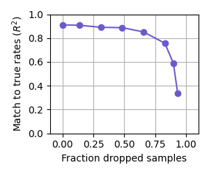

# Selective Backpropagation Through Time Demo
This repo contains a toy example demonstrating selective backpropagation through time (SBTT) [[1]](#1). SBTT is a training strategy for sparsely sampled, time-varying data with latent dynamical structure, and has been applied to synthetic and real datasets in neuroscience. It consists of zero-filling missing data at the input and limiting backpropagation of error to observed neuron-timepoints.
## Setup
To create an environment and install the dependencies of the project, run the following commands:
```
git clone git@github.com:snel-repo/sbtt-demo.git
cd sbtt-demo
conda create --name sbtt-demo python
conda activate sbtt-demo
pip install -r requirements.txt
```
The functions of various scripts and modules should be self-explanatory (`train.py`, `model.py`, etc.). Pre-trained models and their training history and hyperparameters can be found in `lightning_logs`.
## Lorenz Dataset
The dataset consists of trajectories from a simulated latent Lorenz oscillator, projected into the neural dimension (29) and sampled as a Poisson process. The Lorenz systems were simulated for 50 time steps at 20 ms intervals. There are 65 unique rate conditions, each sampled 24 times, for a total of 1560 samples. These samples are split 80/20, creating a 1248-sample training set and 312-sample validation set. Conditions are represented equally in training and validation sets. To simulate bandwidth-limited sampling, we mask a random fraction of the spike counts at each time step in each sample. 
## Model Architecture
We use a simple sequential autoencoder in these experiments, where the encoding network is a bidirectional GRU. The final hidden states of the encoder are further compressed via a linear layer, and then used as the initial states for a unidirectional GRU which unrolls without input for the full length of the sequence. The GRU states are projected back into log-rates in the neural dimension via a linear readout. The rates are optimized via Poisson negative log-likelihood across observed neuron-timepoints. We use dropout and weight decay for regularization, but these were not tuned exhaustively.
## Results
We find that the autoencoders can learn to infer highly accurate firing rates for the synthetic system, even when a majority of neuron-timepoints are not observed. The network uses information at observed points to provide context at unobserved points. In our NeurIPS 2021 conference paper, we discuss how this approach is useful for denoising and interpolating the activity of large neural populations with limited recording bandwidth (e.g. in electrophysiology or calcium imaging).




## References
<a id="1">[1]</a> TODO: Add reference to SBTT from NeurIPS 2021
